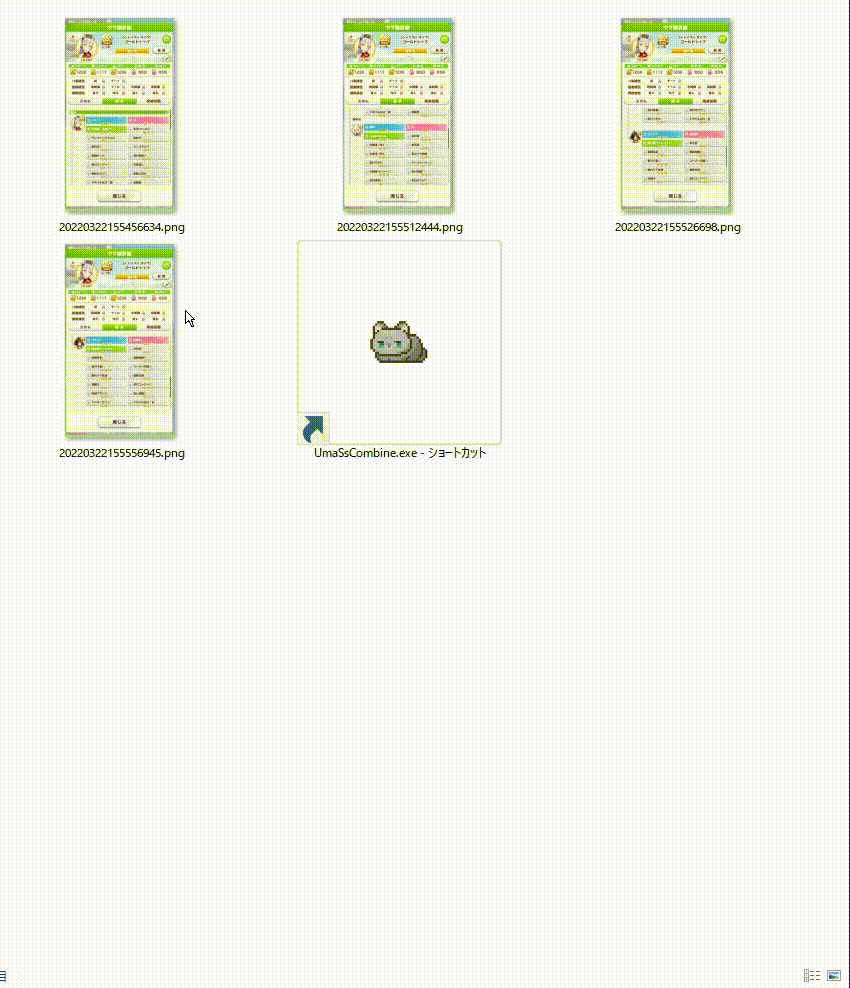
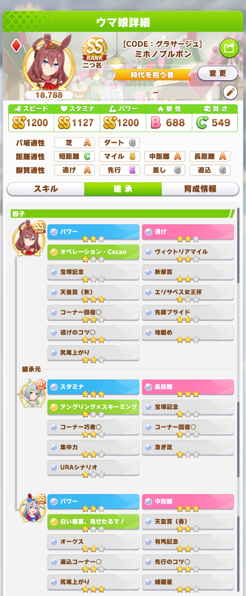
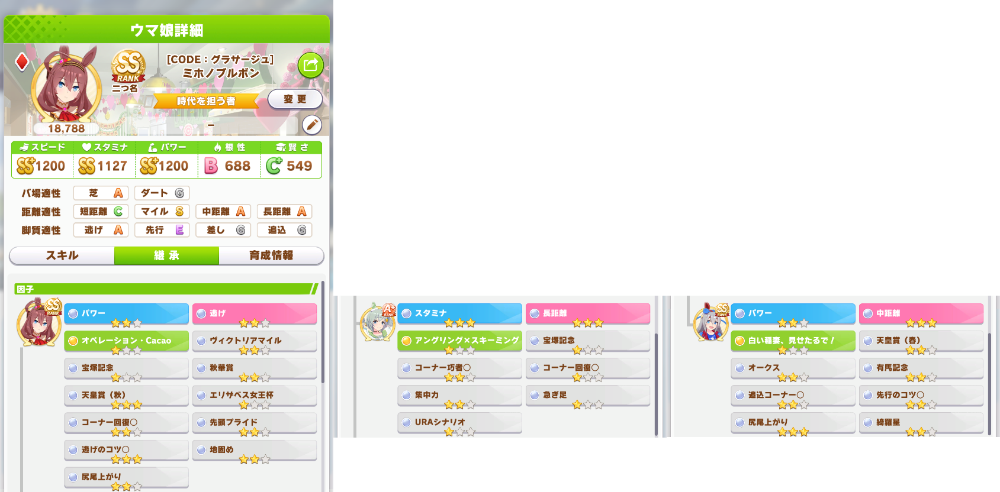
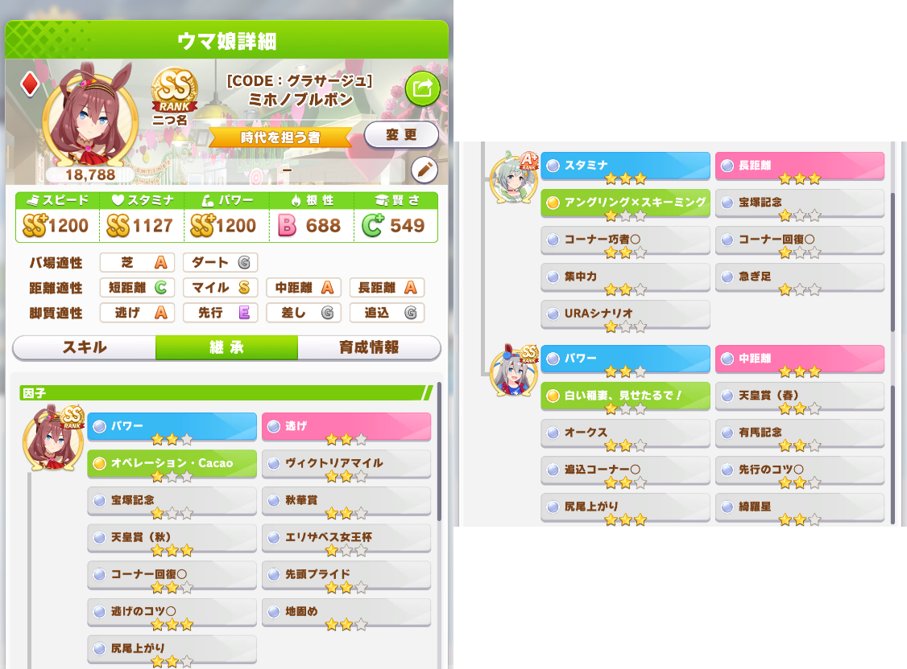
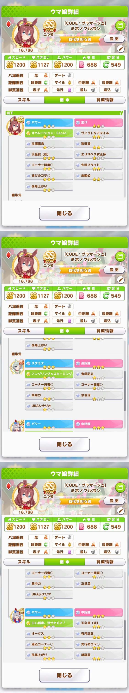
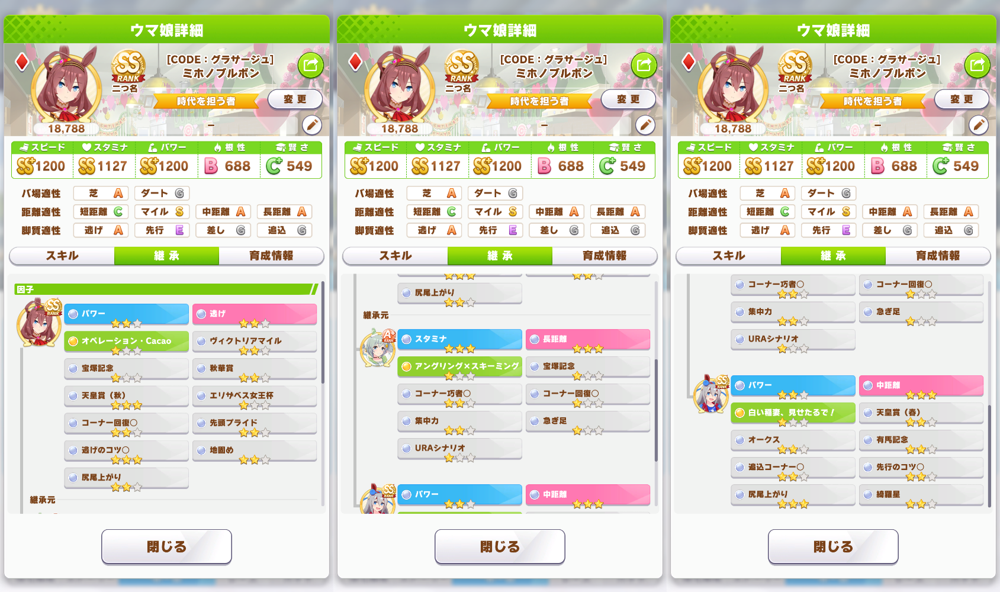
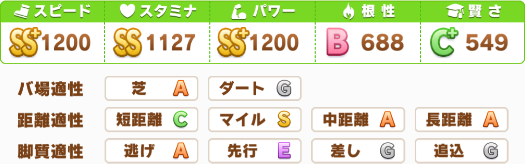
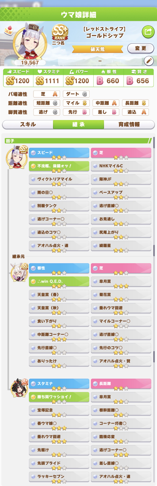
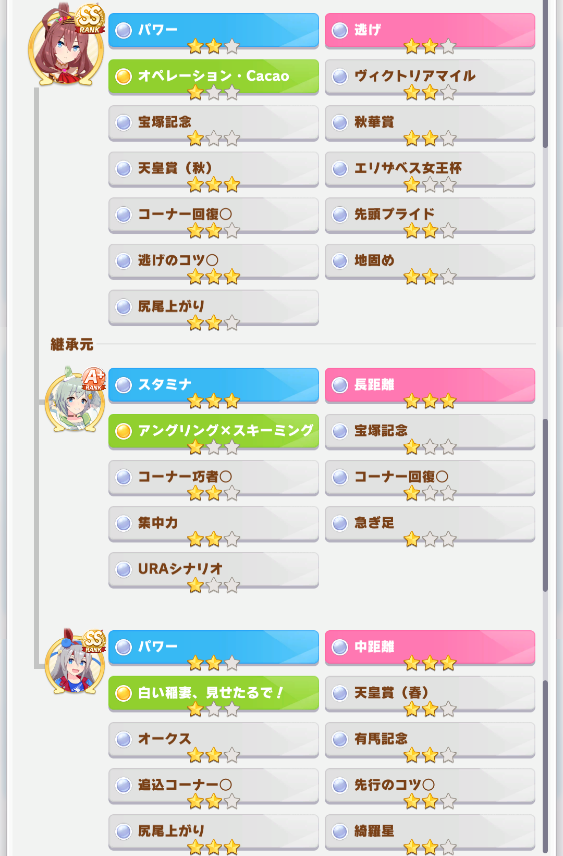
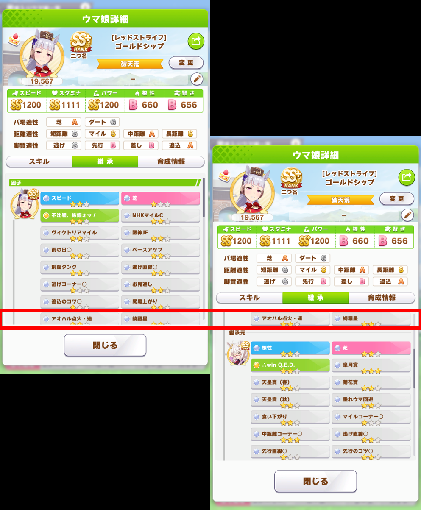

# UmaSsCombine
## このツールは？
「ウマ娘詳細」画面の「継承タブ」の複数枚画像を1枚に結合するツールです

## 動作環境
Windows10 64bit  
(Windows11でも多分動きます)  
※64bit版でしか動作しません  
※ウマ娘が64bit版でしか動作しないのでウマ娘が動く環境なら問題ありません

## インストール方法
zipファイルを適当なフォルダに解凍して下さい  
追加で、以下のインストールが必要です  

[.NET Core 3.1 Runtime](https://dotnet.microsoft.com/download/dotnet/3.1/runtime/)    
Run desktop appsのDownload x64  

## アンインストール方法
レジストリ等使用していませんのでフォルダの削除だけです  

---  

# 使い方

- 結合したい複数の「継承タブ」画面のスクリーンショットをUmaSsCombine.exeにドラッグ&ドロップして下さい  
結合元の画像を同じフォルダに結合した画像を出力します(ファイル名は「年月月日時分秒ミリ秒.png」)

- 結合元画像の処理順  
デフォルトはファイル名の昇順に処理を実行していきます  
処理順を変更したい場合は、以下を参考にしてください 
    - 降順に変更したい  
config.jsonの「sortOrder」の"ascending"を"descending"に変更してください  
    - ファイルの作成日時順に処理をさせたい  
config.jsonの「sortTarget」を"timeStamp"に変更してください  
(昇順・降順は「sortOrder」で指定してください)  
    - ドラッグ&ドロップした順に処理させたい  
config.jsonの「sortTarget」を"none"に変更してください  
(昇順・降順は指定できません)

## レイアウト指定
レイアウトの指定内容により、出力画像の種類が変わります  
config.jsonの「Layout」で指定します  

| Layout指定文字列 | 名称 | 説明 | サンプル |
|:----|:----|:----|:----:|
| vertical | 縦結合 | 様々な画面を縦方向に結合します |  |
| horizontal | 横結合 | 継承タブ画面をウマ娘毎に横方向に結合します  ※継承タブ画面以外では動作しません |  |
| pedigree | 血統表 | 継承タブ画面を血統表の様に結合します  ※継承タブ画面以外では動作しません |  |
| simpleVertical | 単純縦結合 | 結合位置を判定せず、入力された画像を単純に縦方向へ結合します  ※画像毎の解像度を統一する必要はありません |  |
| simpleHorizontal | 単純横結合 | 結合位置を判定せず、入力された画像を単純に横方向へ結合します  ※画像毎の解像度を統一する必要はありません |  |
| clip | 矩形切り抜き | 指定範囲の矩形を切り抜いて出力します  複数枚入力された場合も、すべて同一範囲で切り抜きを行います  指定座標はconfig.jsonの「clipRect」で設定(X,Y,Width,Height)します |  |

## オプション機能
縦結合、横結合、血統表レイアウトは別途オプションの指定が可能です  
config.json内の各オプション名をtrueに設定すると動作します  
上記以外の結合ではオプションの指定は無視されます
| オプション名 | 名称 | 説明 | サンプル |
|:----|:----|:----|:----:|
| deleteScrollBar | スクロールバー消去 | スクロールバーを消去します  ※スキルタブ・継承タブ画面での動作は保証しません(綺麗に消えません) |  |
| deleteSideMargin | 左右切り落とし | 画面左右の余白を切り落とします  ※スキルタブ・継承タブ画面での動作は保証しません(切り落とされなかったり、切り落としすぎたり) |  |
| factorOnly | 因子のみ | 因子のみ出力します  ※継承タブ画面以外では動作しません |  |

## 注意点
- レイアウトが「単純縦(横)結合」以外は、結合元の画像はすべて同じ解像度にして下さい  
1枚でも解像度が違うとエラーと判定します
- 結合処理において、最下段のスキルを元に次画像結合位置を決めています  
最低1行分はスキルを被せて撮影すると結合処理が上手くいきます(下の赤枠参照)  

- 結合に失敗した場合は、結合元の画像を同じフォルダに「年月月日時分秒ミリ秒._error.txt」が生成されます  
エラー内容とスクリーンショットを頂ければ、対応します

## エラー内容について
- 2つ以上の画像ファイルを指定してください  
-> そのままの意味です
- 異なる解像度の画像が入力されています  
-> 結合対象の画像はすべて同じ解像度にしてください
- n番目の画像のテンプレートマッチに失敗しました  
- n番目とn+1番目の画像の一致箇所が見つかりませんでした  
-> 画像間で最低1行分はスキルを被せて撮影してくだい
- 境界の取得に失敗しました(幅:XX 高さ:XX 左:XX 右:XX)  
- n番目の画像の境界(下)の取得に失敗しました  
-> 結合に失敗したスクショとエラー内容を連絡ください

## エラー報告等連絡先
[ポチTwitter](https://twitter.com/aoneko_uma)

## Special Thanks
アプリケーションのアイコンは「[なお](https://twitter.com/Bcat151)」さんに頂きました  
